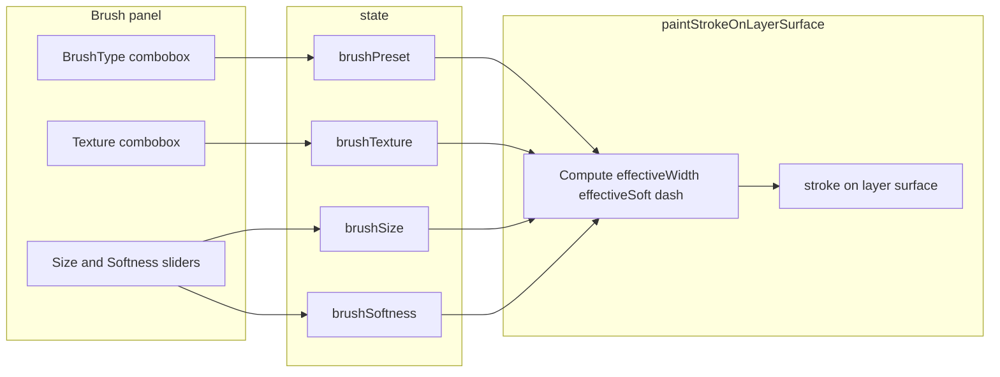

# Brush + Texture controls on brush palette

## Scope

- Implement the two labeled dropdowns at the **top** of the brush panel (above the three toggles), with defaults **Smooth** and texture **None** (locked texture set below).
- **Dropdown visuals** follow the provided pattern ([reference PNG](file:///Users/jleelodge/.cursor/projects/Users-jleelodge-Documents-avatar-prototype/assets/Screenshot_2026-05-05_at_1.34.04_PM-ff349305-d020-44df-9b0f-47b2b92bf678.png)): not a native `<select>` menu — use a **custom combobox** so borders, radii, menu gap, and dashed hover/focus rings match Figma.
- Persist selection on `state` and wire **stroke behavior** in [`paintStrokeOnLayerSurface`](file:///Users/jleelodge/Documents/avatar-prototype/index.html) (same function that already sets `lineWidth`, `shadowBlur`, and `strokeStyle` around lines 2928–2970).
- Align tray copy with the reference: set [`toolTitles.brush`](file:///Users/jleelodge/Documents/avatar-prototype/index.html) from `'Paintbrush'` to `'Brush'` so `#trayTitle` matches when the brush tool is active.

## DOM ([`#panel-brush`](file:///Users/jleelodge/Documents/avatar-prototype/index.html) ~2187)

Insert a wrapper (e.g. `brush-select-block`) with **two custom comboboxes** (same component structure twice):

| Row label (UI) | `data` / id root | Options (label → internal key) |
|----------------|------------------|--------------------------------|
| **Brush Type** | `brushTypeCombo` / `brushPreset` | Smooth → `smooth`, Wet → `wet`, Dry → `dry`, Stamp → `stamp` |
| **Texture** | `brushTextureCombo` / `brushTexture` | None → `none`, Fine grain → `grain`, Stipple → `stipple`, Shimmer → `shimmer` |

**Combobox structure (each row):**

- **Label** — white text, above the trigger; **~4–8px** gap below label to trigger (match tray typography to existing `section-label` / panel labels).
- **Trigger** — `button[type="button"]` (or `div` + `role="combobox"` + `aria-expanded` / `aria-controls` if you prefer full a11y in one pass): full width, **~8px** corner radius, **1px solid** border **#fff** (or tray token), dark fill, **chevron** right, current selection text left (placeholder style when empty — N/A here since defaults exist).
- **Listbox** — absolutely positioned below trigger with **~4px** vertical gap (so menu does not touch trigger); container **~12px** radius, **1px** white border, dark fill, z-index above tray body.
- **Options** — each row is a button or `role="option"`; default text white; **hover and keyboard focus** use **rounded** outline: **white dashed** border (as in reference — e.g. `border: 1px dashed #fff` on an inner wrapper or `outline` with caution for radius).
- **Behavior** — click trigger toggles; click outside closes; **Escape** closes; selecting an option updates label, `state`, closes menu; optional: arrow keys / Home/End on list (nice-to-have).

Accessibility baseline: label `for` + hidden native select is **not** required if using `aria-labelledby` + `role="listbox"` on container and `role="option"` + `aria-selected` on items; at minimum ensure trigger has `aria-expanded` and `aria-haspopup="listbox"`.

### Brush type — intended stroke feel (for `BRUSH_PRESET_STROKE`)

- **Smooth**: neutral; current line + softness behavior as baseline.
- **Wet**: more blendy / glossy feel — slightly higher effective blur or alpha buildup along the stroke; pairs well with shimmer textures.
- **Dry**: chalky / breaks up — lower blur, optional stronger dash contribution from texture, slightly lower effective alpha per segment so it “skips” more.
- **Stamp**: spaced dabs along the path — implement via stamp spacing (repeat `drawImage` or short strokes with gaps) rather than a continuous line only; distinct from Smooth/Wet/Dry.

### Texture menu — **locked for v1**

| Label | Key | Stroke implementation notes |
|-------|-----|------------------------------|
| None | `none` | No extra dash / no second pass beyond brush type. |
| Fine grain | `grain` | Tight `setLineDash` or very low-opacity micro-stroke pass; subtle at normal zoom. |
| Stipple | `stipple` | Coarser dash or repeated short gaps; pairs with **Dry**. |
| Shimmer | `shimmer` | Second pass: sparse white/light dots or thin highlight stroke; stacks with **Wet** / **Metallic**. |

**Deferred (not in v1 dropdown):** “Soft weave” and other variants can be added later without changing keys above.

Keep existing toggles, sliders, and color UI unchanged below this block.

## CSS (brush panel block ~599)

- **Combobox**: Trigger **~8px** radius, list panel **~12px** radius, **1px** `#fff` borders, **~4px** gap between trigger bottom and list top (margin-top on list or translate). Chevron aligned end; comfortable horizontal padding; list item vertical rhythm consistent with reference.
- **Option hover/focus**: Rounded rect + **dashed white** border (match screenshot; avoid fighting native `outline` — use a class on `:focus-visible` and `:hover` for mouse).
- **Spacing**: Same panel rhythm as before:
  - `#panel-brush > .brush-select-block` — **8px** between the two combobox rows.
  - `#panel-brush > .brush-select-block + .toggle-row { margin-top: 16px; }`
  - `#panel-brush > .toggle-row:last-of-type + .slider-row { margin-top: 16px; }`

## State and listeners

- Extend [`state`](file:///Users/jleelodge/Documents/avatar-prototype/index.html) (~2456) with `brushPreset: 'smooth'` and `brushTexture: 'none'`.
- Add two small constant maps (near other config, e.g. after `MAKEUP_GROUP_TYPES`):
  - **`BRUSH_PRESET_STROKE`**: keys `smooth` | `wet` | `dry` | `stamp` — multipliers / flags when `state.activeTool === 'brush'` (e.g. `softMul`, `widthMul`, `alphaMul`, `stampSpacing` for stamp mode).
  - **`TEXTURE_STROKE`**: keys `none` | `grain` | `stipple` | `shimmer` — `lineDash` / second-pass / `globalAlpha` as in texture table above.

- Combobox **selection** updates `state` and trigger label text; optional `updateBrushPreviews()` unchanged (slider-driven preview).

## Stroke wiring ([`paintStrokeOnLayerSurface`](file:///Users/jleelodge/Documents/avatar-prototype/index.html))

Only in the brush branch (not eraser):

1. Compute `effectiveWidth = state.brushSize * widthMul`.
2. Compute `effectiveSoft = state.brushSoftness * softMul` (**Dry** preset can clamp blur harder; **Stamp** uses its own spacing logic).
3. Apply existing `shadowBlur = effectiveSoft * 0.4` (and metallic boost logic unchanged, applied after base blur).
4. Before `stroke()`: `setLineDash` from texture map where applicable; **Stamp** brush type may bypass continuous `lineTo` and use spaced stamps (separate small helper or branch). Use `save`/`restore` so dash and alpha do not leak.

Eraser path unchanged.

## Verification

- Open tray → Brush: **Brush Type** + **Texture** comboboxes match Figma pattern (borders, radii, gap, dashed hover); toggles and sliders unchanged below.
- Draw: **Smooth / Wet / Dry / Stamp** are visibly different; texture changes grain/stipple/shimmer on top.
- No regressions to full-face / regional routing (`drawSegment` unchanged).

